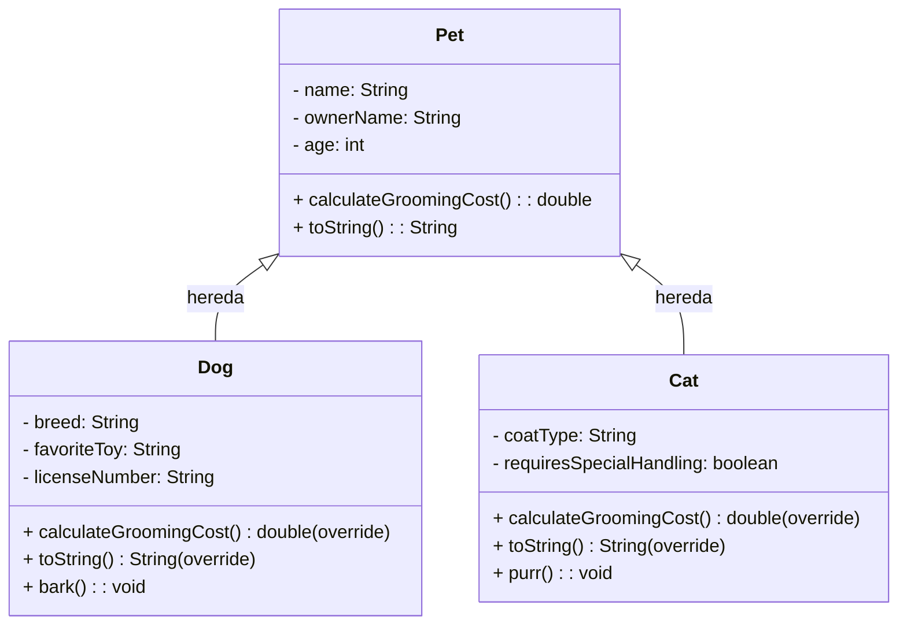

#  JERARQUÍA IMPLEMENTADA - SEMANA 04: HERENCIA

## Dominio Asignado: Mascotas Elegantes

### 1. Jerarquía Identificada: Relación "Es Un Tipo De"

La refactorización se basa en la jerarquía: **[Subclase] es un tipo de [Clase Padre]**.

| Clase Padre (Superclase) | Subclase 1 | Subclase 2 |
| :--- | :--- | :--- |
| **Pet** | **Dog** | **Cat** |

---

### 2. Implementación de Herencia y Polimorfismo

Este dominio utiliza Herencia y Polimorfismo para gestionar las diferentes especies de mascotas.

| Característica | Detalle de Implementación |
| :--- | :--- |
| **Encapsulación** | Los atributos en `Pet.java` son **`private`** (Encapsulación), usando **`getters`** para que las subclases accedan a los datos de forma controlada. |
| **Herencia (`extends` / `super`)** | `Dog.java` y `Cat.java` utilizan **`extends Pet`** y llaman a **`super(...)`** en sus constructores. |
| **Polimorfismo (Sobrescritura)** | Se utilizó **`@Override`** en dos métodos clave: **`calculateGroomingCost()`** (para aplicar costos específicos) y **`toString()`** (para imprimir la información completa). |
| **Lógica de Negocio** | El costo base es definido en `Pet`, y el recargo específico se añade en `Dog` o `Cat` usando `super.calculateGroomingCost()`. |

---

### 3. Diagrama UML de la Jerarquía

Este diagrama muestra los atributos y métodos clave, incluyendo la privacidad y los métodos sobrescritos.

